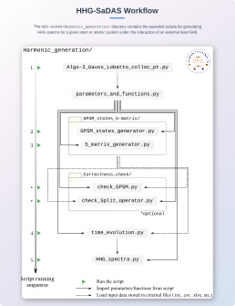

# HHG-SaDAS  
> For simulating Higher-order Harmonic Generation (HHG) using the Generalized Pseudospectral Method (GPSM) and the Split-Operator Method.


---

## What is HHG-SaDAS?

**HHG-SaDAS** is a package to simulate HHG in atoms and atomic systems by solving the **3D time-dependent Schrödinger equation** using:

- **Generalized Pseudospectral Method (GPSM)**
- **Split-Operator Method**

---

This repository contains the core codes developed during **June–December 2024** as part of my *Master of Science (Research)* degree at the **Indian Institute of Technology (IIT) Mandi, India**.  
The overall tenure of my MS(R) program was **August 2022 – August 2025**.

These codes form an integral part of my MS(R) thesis and are released to ensure academic transparency and reproducibility of the research.

The original Git repository, maintained throughout the research period, is kept private.  
Whereas, this public repository is a streamlined version, providing the main useful codes in a straightforward manner.


---

### Thesis Information

- **MS(R) Thesis Title:** *Higher-Order Harmonic Generation and Harmonic-Power Enhancement in Noble-Gas Atoms Confined Inside C60*  
- **Thesis Supervisor:** Prof. Hari R. Varma  
- **Research Group:** Structure and Dynamics of Atomic Systems (SaDAS)  
- **Group Website:** [https://sadas.iitmandi.ac.in/index.php](https://sadas.iitmandi.ac.in/index.php)

---


# Installation Guide

### Prerequisites
- Git installed on your system
- Python 3.11 or higher
- PowerShell (for Windows users)


### 1. Clone the repository
```bash
git clone git@github.com:Siddhartha-Acad/HHG-SaDAS.git
cd HHG-SaDAS
```

### 2. Create and activate a virtual environment

**For Linux/macOS:**
```bash
python3 -m venv venv_HHG
source venv_HHG/bin/activate
```

**For Windows (PowerShell):**
```powershell
py -3.11 -m venv venv_HHG
.\venv_HHG\Scripts\Activate.ps1
```

### 3. Install dependencies
```bash
pip install -r requirements.txt
```

## Notes
- The virtual environment step is optional but recommended to avoid package conflicts
- If you encounter permission issues on Windows, you may need to run PowerShell as Administrator

---

# Workflow

<p align="center">
  
</p>

### A brief description of the workflow diagram:

**Step 1: `Algo-3_Gauss_Lobatto_colloc_pt.py`**  
> Navigate to: `/HHG-SaDAS/Harmonic_generation/Collocation_points/Colloc_pt_generator/`  
>  
> Here you will find the script `Algo-3_Gauss_Lobatto_colloc_pt.py`, which computes the **Gauss–Lobatto collocation points** using *Algorithm 3*, as described in my thesis:  
>> *Appendix A: "An efficient algorithm to numerically calculate the Gauss–Lobatto collocation points."*  
> 
> After computation, the collocation points are automatically written to a `.txt` file for later use.  

**Step 2: `parameters_and_functions.py`**  
> The generated collocation point data (`.txt` file) is passed into `parameters_and_functions.py`.  
> As the name suggests, this script centralizes all the required **parameters** and **Python functions** in one place.  
>  
> Users only need to modify a given parameter once inside this file. All other scripts will then read the updated values and functions directly from it.  
>  
> As indicated by the outgoing solid arrow in the workflow diagram, `parameters_and_functions.py` distributes these parameters to all subsequent scripts.  

**Step 3: `GPSM_states_generator.py` & `S_matrix_generator.py`**

> Inside the directory `/HHG-SaDAS/Harmonic_generation/GPSM_states_S-matrix/`
> 
> `GPSM_states_generator.py` solves the time independent Schrödinger equation for atomic system (free or confined) defined inside the `parameters_and_functions.py` script.
> 
> Thereafter, it saves the solutions, for a particular `l` value inside the self-generated path: `/GPSM_states_S-matrix/GPSM_states_and_Smatrix_data/` as an `.xlsx` file with the given format:
>```
>state_file = He_States_SAE-M1__l=0_nos=10_N=200_rmax=200_Lmap=20.xlsx
>
>+-----+-------------+----------+----------+----------+-----+----------+
>| Row | r(x) (a.u.) |   A(1s)  |   A(2s)  |   A(3s)  | ... |  A(10s)  |
>+-----+-------------+----------+----------+----------+-----+----------+
>|  1  | 0.00166     | -0.00041 |  4.6E-05 | 0.000118 | ... | 8.64E-06 |
>|  2  | 0.005566    |  0.001819| -0.00021 | -0.00053 | ... | -3.9E-05 |
>|  3  | 0.011707    | -0.00454 |  0.000513| 0.001318 | ... | 9.63E-05 |
>|  4  | 0.020085    |  0.00877 | -0.00099 | -0.00254 | ... | -0.00019 |
>| ... | ...         | ...      | ...      | ...      | ... | ...      |
>+-----+-------------+----------+----------+----------+-----+----------+
>| 199 | 199.7993166 |-7.14E-13 |-1.38E-10 | 5.80E-11 | ... |-0.000331 |
>+-----+-------------+----------+----------+----------+-----+----------+
>```

> `S_matrix_generator.py` script solves the time independent Schrödinger equation and calculates the **S-matrix** for all `l` values in the range `l = (m, l_max+m)`.
> 
> The S-matrix elements are shown below, with detailed derivation and analysis in `Appendix B`.
>
><div align="center">
><picture>
>  <source media="(prefers-color-scheme: dark)" srcset="https://latex.codecogs.com/svg.latex?\color{white}S_%7B%5Calpha%5Cbeta%7D%28%5Cell%29%20%3D%20%5Csum_%7Bk%3D1%7D%5E%7Bk_%7Bmax%7D%7D%20A_%7Bk%5Calpha%7D%28%5Cell%29%20%5Cexp%5C%7B-iE_k%28%5Cell%29%5Cdelta%20t/2%5C%7D%20A_%7Bk%5Cbeta%7D%28%5Cell%29">
>  <source media="(prefers-color-scheme: light)" srcset="https://latex.codecogs.com/svg.latex?\color{black}S_%7B%5Calpha%5Cbeta%7D%28%5Cell%29%20%3D%20%5Csum_%7Bk%3D1%7D%5E%7Bk_%7Bmax%7D%7D%20A_%7Bk%5Calpha%7D%28%5Cell%29%20%5Cexp%5C%7B-iE_k%28%5Cell%29%5Cdelta%20t/2%5C%7D%20A_%7Bk%5Cbeta%7D%28%5Cell%29">
>  
></picture>
></div>
>
>After computing the S-matrices (with `shape=(N-1, N-1)`), it flattens each matrix (with `shape=((N-1)*(N-1),)`) and stores them in consecutive columns in a dedicated `.xlsx` file with the format:
>                                       
>```
>S_matrix_file = 'He_Smatrix_SAE-M1__m=1_lmax=20_kmax=50_N=200_r_max=200_L_map=80_dt=0.1.xlsx'
>
>+-----+---------------+---------------+---------------+---------------+-----+---------------+
>| Row |    S(l=1)     |    S(l=2)     |    S(l=3)     |    S(l=4)     | ... |   S(l=21)     |
>+-----+---------------+---------------+---------------+---------------+-----+---------------+
>|  1  | (1.028e-14,   | (4.204e-22,   | (3.431e-24,   | (2.106e-24,   | ... | (2.902e-24,   |
>|     |  -3.338e-17)  |  -3.592e-24)  |  -1.813e-26)  |  -1.942e-26)  |     |  -5.925e-26)  |
>+-----+---------------+---------------+---------------+---------------+-----+---------------+
>|  2  | (-1.545e-13,  | (-2.159e-20,  | (2.993e-23,   | (1.965e-23,   | ... | (3.212e-23,   |
>|     |  5.016e-16)   |  1.953e-22)   |  -1.612e-25)  |  -1.812e-25)  |     |  -6.558e-25)  |
>+-----+---------------+---------------+---------------+---------------+-----+---------------+
>|  3  | (8.164e-13,   | (2.398e-19,   | (9.406e-23,   | (6.743e-23,   | ... | (1.387e-22,   |
>|     |  -2.651e-15)  |  -2.149e-21)  |  -4.245e-25)  |  -6.211e-25)  |     |  -2.833e-24)  |
>+-----+---------------+---------------+---------------+---------------+-----+---------------+
>|  4  | (-2.726e-12,  | (-1.379e-18,  | (2.017e-22,   | (1.492e-22,   | ... | (3.957e-22,   |
>|     |  8.852e-15)   |  1.239e-20)   |  -1.771e-24)  |  -1.374e-24)  |     |  -8.080e-24)  |
>+-----+---------------+---------------+---------------+---------------+-----+---------------+
>|  5  | (7.009e-12,   | (5.436e-18,   | (2.933e-22,   | (2.633e-22,   | ... | (8.895e-22,   |
>|     |  -2.276e-14)  |  -4.879e-20)  |  2.741e-24)   |  -2.413e-24)  |     |  -1.816e-23)  |
>+-----+---------------+---------------+---------------+---------------+-----+---------------+
>|  6  | (-1.521e-11,  | (-1.681e-17,  | (6.506e-22,   | (4.020e-22,   | ... | (1.712e-21,   |
>|     |  4.939e-14)   |  1.510e-19)   |  -2.223e-23)  |  -3.737e-24)  |     |  -3.496e-23)  |
>+-----+---------------+---------------+---------------+---------------+-----+---------------+
>| ... | ...           | ...           | ...           | ...           | ... | ...           |
>+-----+---------------+---------------+---------------+---------------+-----+---------------+
>|39601| (1.311e-03,   | (1.360e-03,   | (1.422e-03,   | (1.464e-03,   | ... | (2.167e-03,   |
>|     |  -1.134e-05)  |  -1.207e-05)  |  -1.302e-05)  |  -1.368e-05)  |     |  -2.703e-05)  |
>+-----+---------------+---------------+---------------+---------------+-----+---------------+
>```


**Step 4: `check_GPSM.py` & `check_Split_operator.py` (optional)**

> Inside the directory: `/HHG-SaDAS/Harmonic_generation/Correctness_check/`  
> 
> **`check_GPSM.py`** script takes information about the atom (free or confined) of interest and other parameters from `parameters_and_functions.py`, and independently solves the **time-independent Schrödinger equation** using GPSM and visualizes the results through various plots, including different sets of eigenvectors (both collectively and individually).  
>
> Using the GPSM solutions (eigenvalues and eigenvectors for a particular `l`), it also calculates the **S-matrix** and displays it as a 2D color-mapped matrix.  
>
> In addition to plotting eigenvectors, the script verifies their **normalization**, prints the results, and outputs other important information regarding the parameters used.
> 
> ***Example console output:***
>```console
>$ python3 check_GPSM.py
>~~~~~~~~~~~~~: Grid info :~~~~~~~~~~~~~
>mapping param (L_map)       : 80
>mapping param (r_max)       : 200
>radial colloc points (N-1)  : 199
>angular colloc points (L+1) : 21
>~~~~~~~~~: Atom & Laser info :~~~~~~~~~
>atom system   : He
>initial state : (n=1, l=1, m=1) ~ 2p --> time_evolution.py
>I0 (W/cm2)    : 5.00e+13
>...
>...
>...
>~~~~~~~~~~~~~~~~: GPSM :~~~~~~~~~~~~~~~
>No of Eigenvalues found  : 6
>H shape                  : (199, 199)
>H[0][0]                  : 58820.53831098895
>H[-1][-1]                : 149.90473426757345
>E[0](eV) ~ l=1           : -6.868420982813965
>A[0][0]                  : -2.4141140190625256e-07
>A[0][-1]                 : 3.037738116606903e-11
>norm A[0] = sum(A^2)     : 1.0
>norm φ[0] = int(|φ|^2)   : 1.0000000000000002
>E[0]~2p : -0.252409815535524 a.u
>E[1]~3p : -0.068686756344595 a.u
>E[2]~4p : -0.041126895507584 a.u
>E[3]~5p : -0.024855529617141 a.u
>E[4]~6p : -0.016561274637765 a.u
>E[5]~7p : -0.011828359154589 a.u
>u(r) dataset shape       : (6, 199)
>S(l=1)-matrix shape      : (199, 199) 
>Execution Time (h, m, s) : (0, 0, 3)
>```

> **`check_Split_operator.py`** script takes necessary information from `parameters_and_functions.py`, and importantly, reads GPSM_states data and S-matrix data that were previously generated by `GPSM_states_generator.py` & `S_matrix_generator.py`.
> 
> Thereafter, it calculates a single-step time evolution of the initial wavefunction and shows detailed numerous plots to verify that each intermediate step (details in Appendix C) are computed correctly.
> 
> To check the computed S-matrices are correctly computed, following the method to check their correctness as described in `Section C.2: A way to ensure the correctness of S-matrix`, it checks the condition:
> 
> <div align="center">
> <picture>
>   <source media="(prefers-color-scheme: dark)" srcset="https://latex.codecogs.com/svg.latex?\color{white}%7Cg_%7B%5Cell%7D%28r_i%2C%5Cdelta%20t/2%29%7C%5E2%20%3D%20%5Cleft%7C%5Csum_%7Bj%3D1%7D%5E%7BN-1%7D%20S_%7Bij%7D%28%5Cell%29%20g_%7B%5Cell%7D%28r_j%29%5Cright%7C%5E2%20%3D%20%7Cg_%7B%5Cell%7D%28r_i%2C%200%29%7C%5E2">
>   <source media="(prefers-color-scheme: light)" srcset="https://latex.codecogs.com/svg.latex?\color{black}%7Cg_%7B%5Cell%7D%28r_i%2C%5Cdelta%20t/2%29%7C%5E2%20%3D%20%5Cleft%7C%5Csum_%7Bj%3D1%7D%5E%7BN-1%7D%20S_%7Bij%7D%28%5Cell%29%20g_%7B%5Cell%7D%28r_j%29%5Cright%7C%5E2%20%3D%20%7Cg_%7B%5Cell%7D%28r_i%2C%200%29%7C%5E2">
>   
> </picture>
> </div>
> 
> The script will plot the LHS and RHS overlapping together to verify their agreement.

> Collectively, the two scripts `check_GPSM.py` & `check_Split_operator.py` make sure everything is going correctly and we are now good to go for the full time evolution code `time_evolution.py`.
> 
> **[NOTE] :** This step is optional but strongly recommended to verify correctness before proceeding with the full simulation.

---


## License

This project is licensed under the [MIT License](LICENSE).
