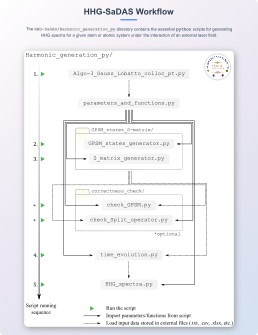
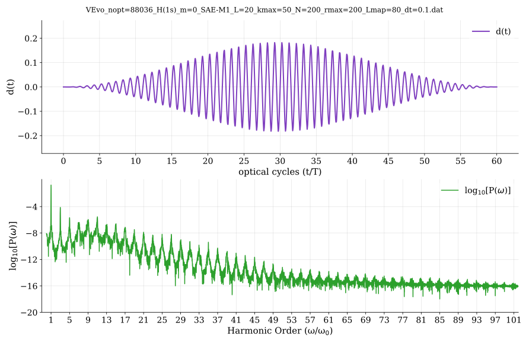
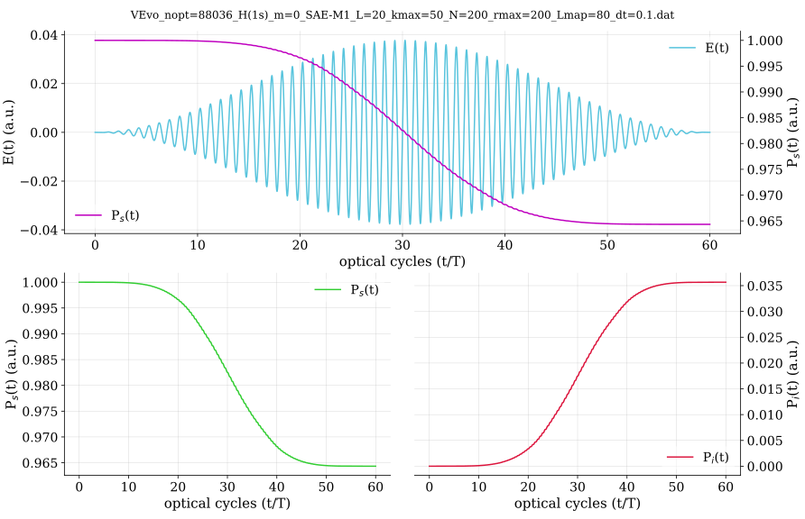

# HHG-SaDAS

<p align="center">
  <picture>
    <source media="(prefers-color-scheme: dark)" srcset="z_doc_figures/Theory_flow_dark.svg">
    <source media="(prefers-color-scheme: light)" srcset="z_doc_figures/Theory_flow_light.svg">
    
  </picture>
</p>

> For simulating Higher-order Harmonic Generation (HHG) using the Generalized Pseudospectral Method (GPSM) and the Split-Operator Method.


---

## What is HHG-SaDAS?

**HHG-SaDAS** is a package to simulate HHG in atoms and atomic systems by solving the **3D time-dependent Schrödinger equation** using:

- **Generalized Pseudospectral Method (GPSM)**
- **Split-Operator Method**

---

This repository contains the core codes developed during **June–December 2024** as part of my *Master of Science (Research)* degree at the **Indian Institute of Technology (IIT) Mandi, India**.
The overall tenure of my MS(R) program was **August 2022 – August 2025**.

These codes form an integral part of my MS(R) thesis and are released to ensure academic transparency and reproducibility of the research.

---

### Thesis Information

- **MS(R) Thesis Title:** *Higher-Order Harmonic Generation and Harmonic-Power Enhancement in Noble-Gas Atoms Confined Inside C60*
- **Thesis Supervisor:** Prof. Hari R. Varma
- **Research Group:** Structure and Dynamics of Atomic Systems (SaDAS)
- **Group Website:** [https://sadas.iitmandi.ac.in/index.php](https://sadas.iitmandi.ac.in/index.php)

---

# Installation

#### Prerequisites : Git | Python 3.11 | Fortran

### 1. Clone the repository
```bash
git clone git@github.com:Siddhartha-Acad/HHG-SaDAS.git
cd HHG-SaDAS
```

### 2. Create a virtual environment & Install dependencies

```bash
python3 -m venv venv_HHG
source venv_HHG/bin/activate

pip install -r requirements.txt
```

### 3. RUN simulation (python or Fortran)
```bash
cd Harmonic_generation_py/ && make
or,
cd Harmonic_generation_f90/ && make
make run_vector_time_evolution OMP_NUM_THREADS=2
```

---

# Workflow

<p align="center">

</p>

## A brief description of the workflow diagram:

**Step 1: `Algo-3_Gauss_Lobatto_colloc_pt.py`**
> Inside the directory `/HHG-SaDAS/Harmonic_generation_py/collocation_points/generator/`
>
> `Algo-3_Gauss_Lobatto_colloc_pt.py` computes the **Gauss–Lobatto collocation points** using *Algorithm 3*, as described in my thesis:
>> *Appendix A: "An efficient algorithm to numerically calculate the Gauss–Lobatto collocation points."*
> 
> After computation, the collocation points are automatically written to a `.txt` file for later use.
> With `--plot` flag it will show the computed collocation points.

**Step 2: `parameters_and_functions.py`**
> The generated collocation point data (`.txt` file) is passed into `parameters_and_functions.py`.
> As the name suggests, this script centralizes all the required **parameters** and **Python functions** in one place.
>
> Users only need to modify a given parameter once inside this file. All other scripts will then read the updated values and functions directly from it.
>
> As indicated by the outgoing solid arrow in the workflow diagram, `parameters_and_functions.py` distributes these parameters to all subsequent scripts.

**Step 3: `GPSM_states_generator.py` & `S_matrix_generator.py`**

> Inside the directory `/HHG-SaDAS/Harmonic_generation_py/GPSM_states_S-matrix/`
> 
> **`GPSM_states_generator.py`** solves the time independent Schrödinger equation for atomic system (free or confined) defined inside the `parameters_and_functions.py` script.
> 
> Thereafter, it saves the solutions, for a particular `l` value inside the self-generated path: `/GPSM_states_S-matrix/GPSM_states_and_Smatrix_data/` as an `.dat` file with the given format:
>```
>state_file = He_States_SAE-M1_l=0_nos=10_N=200_rmax=200_Lmap=20.dat
>
> +-----+-------------+-----------+-----------+-----------+-------+-----------+
> | Row | r(x) (a.u.) |   A(1s)   |   A(2s)   |   A(3s)   |  ...  |  A(10s)   |
> +-----+-------------+-----------+-----------+-----------+-------+-----------+
> |   1 | 0.00166     | -0.00041  |  4.6E-05  |  0.000118 |  ...  |  8.64E-06 |
> |   2 | 0.005566    |  0.001819 | -0.00021  | -0.00053  |  ...  | -3.9E-05  |
> |   3 | 0.011707    | -0.00454  |  0.000513 |  0.001318 |  ...  |  9.63E-05 |
> |   4 | 0.020085    |  0.00877  | -0.00099  | -0.00254  |  ...  | -0.00019  |
> | ... | ...         |   ...     |   ...     |   ...     |  ...  |   ...     |
> +-----+-------------+-----------+-----------+-----------+-------+-----------+
> | 199 | 199.7993166 | -7.14E-13 | -1.38E-10 |  5.80E-11 |  ...  | -0.000331 |
> +-----+-------------+-----------+-----------+-----------+-------+-----------+
>```

> **`S_matrix_generator.py`** script solves the time independent Schrödinger equation and calculates the **S-matrix** for all `l` values in the range `l = (m, l_max+m)`.
> 
> The S-matrix elements are shown below, with detailed derivation and analysis in `Appendix B`.
>
><div align="center">
><picture>
><source media="(prefers-color-scheme: dark)" srcset="https://latex.codecogs.com/svg.latex?\color{white}S_%7B%5Calpha%5Cbeta%7D%28%5Cell%29%20%3D%20%5Csum_%7Bk%3D1%7D%5E%7Bk_%7Bmax%7D%7D%20A_%7Bk%5Calpha%7D%28%5Cell%29%20%5Cexp%5C%7B-iE_k%28%5Cell%29%5Cdelta%20t/2%5C%7D%20A_%7Bk%5Cbeta%7D%28%5Cell%29">
><source media="(prefers-color-scheme: light)" srcset="https://latex.codecogs.com/svg.latex?\color{black}S_%7B%5Calpha%5Cbeta%7D%28%5Cell%29%20%3D%20%5Csum_%7Bk%3D1%7D%5E%7Bk_%7Bmax%7D%7D%20A_%7Bk%5Calpha%7D%28%5Cell%29%20%5Cexp%5C%7B-iE_k%28%5Cell%29%5Cdelta%20t/2%5C%7D%20A_%7Bk%5Cbeta%7D%28%5Cell%29">
>
></picture>
></div>
>
>After computing the S-matrices (each with `shape = (N-1, N-1)`), all of them are stored together in a single NumPy binary file (`.npy`) for efficient storage and retrieval.
>The resulting file is a 3D complex array with the format:
>
>```
>S_matrix_file = 'He_Smatrix_SAE-M1_m=1_lmax=20_kmax=50_N=200_r_max=200_L_map=80_dt=0.1.npy'
>data_S_matrix.shape = (l_max + 1, N - 1, N - 1)    # data structure
>
>+-----------------------------+--------------------------+
>|   Array Slice               |   Corresponding S-Matrix |
>+-----------------------------+--------------------------+
>| data_S_matrix[0, :, :]      |  S(l = 0)                |
>| data_S_matrix[1, :, :]      |  S(l = 1)                |
>| ...                         |  ...                     |
>| data_S_matrix[l_max, :, :]  |  S(l = l_max)            |
>+-----------------------------+--------------------------+
>```

**Step 4: `check_GPSM.py` & `check_Split_operator.py` (optional)**

> Inside the directory: `/HHG-SaDAS/Harmonic_generation_py/Correctness_check/`
> 
> **`check_GPSM.py`** script takes information about the atom (free or confined) of interest and other parameters from `parameters_and_functions.py`, and independently solves the **time-independent Schrödinger equation** using GPSM and visualizes the results through various plots, including different sets of eigenvectors (both collectively and individually).
>
> Using the GPSM solutions (eigenvalues and eigenvectors for a particular `l`), it also calculates the **S-matrix** and displays it as a 2D color-mapped matrix.
>
> In addition to plotting eigenvectors, the script verifies their **normalization**, prints the results, and outputs other important information regarding the parameters used.
> 
> ***Example console output:***
>```console
>$ python3 check_GPSM.py
>~~~~~~~~~~~~~: Grid info :~~~~~~~~~~~~~
>mapping param (L_map) : 80
>mapping param (r_max) : 200
>radial colloc points (N-1): 199
>angular colloc points (L+1) : 21
>~~~~~~~~~: Atom & Laser info :~~~~~~~~~
>atom system   : He
>initial state : (n=1, l=1, m=1) ~ 2p --> vector_time_evolution.py
>I0 (W/cm2)    : 5.00e+13
>...
>...
>...
>~~~~~~~~~~~~~~~~: GPSM :~~~~~~~~~~~~~~~
>No of Eigenvalues found: 6
>H shape: (199, 199)
>H[0][0]: 58820.53831098895
>H[-1][-1]: 149.90473426757345
>E[0](eV) ~ l=1 : -6.868420982813965
>A[0][0]: -2.4141140190625256e-07
>A[0][-1] : 3.037738116606903e-11
>norm A[0] = sum(A^2) : 1.0
>norm φ[0] = int(|φ|^2) : 1.0000000000000002
>E[0]~2p : -0.252409815535524 a.u
>E[1]~3p : -0.068686756344595 a.u
>E[2]~4p : -0.041126895507584 a.u
>E[3]~5p : -0.024855529617141 a.u
>E[4]~6p : -0.016561274637765 a.u
>E[5]~7p : -0.011828359154589 a.u
>u(r) dataset shape : (6, 199)
>S(l=1)-matrix shape: (199, 199) 
>Execution Time (h, m, s) : (0, 0, 3)
>```

> **`check_Split_operator.py`** script takes necessary information from `parameters_and_functions.py`, and importantly, reads GPSM_states data and S-matrix data that were previously generated by `GPSM_states_generator.py` & `S_matrix_generator.py`.
> 
> Thereafter, it calculates a single-step time evolution of the initial wavefunction and shows detailed numerous plots to verify that each intermediate step (details in Appendix C) are computed correctly.
> 
> To check the computed S-matrices are correctly computed, following the method to check their correctness as described in `Section C.2: A way to ensure the correctness of S-matrix`, it checks the condition:
> 
> <div align="center">
> <picture>
> <source media="(prefers-color-scheme: dark)" srcset="https://latex.codecogs.com/svg.latex?\color{white}%7Cg_%7B%5Cell%7D%28r_i%2C%5Cdelta%20t/2%29%7C%5E2%20%3D%20%5Cleft%7C%5Csum_%7Bj%3D1%7D%5E%7BN-1%7D%20S_%7Bij%7D%28%5Cell%29%20g_%7B%5Cell%7D%28r_j%29%5Cright%7C%5E2%20%3D%20%7Cg_%7B%5Cell%7D%28r_i%2C%200%29%7C%5E2">
> <source media="(prefers-color-scheme: light)" srcset="https://latex.codecogs.com/svg.latex?\color{black}%7Cg_%7B%5Cell%7D%28r_i%2C%5Cdelta%20t/2%29%7C%5E2%20%3D%20%5Cleft%7C%5Csum_%7Bj%3D1%7D%5E%7BN-1%7D%20S_%7Bij%7D%28%5Cell%29%20g_%7B%5Cell%7D%28r_j%29%5Cright%7C%5E2%20%3D%20%7Cg_%7B%5Cell%7D%28r_i%2C%200%29%7C%5E2">
> 
> </picture>
> </div>
> 
> The script will plot the LHS and RHS overlapping together to verify their agreement.

> Collectively, the two scripts `check_GPSM.py` & `check_Split_operator.py` make sure everything is going correctly and we are now good to go for the full time evolution code `vector_time_evolution.py`.
> 
> **[NOTE] :** This step is optional but strongly recommended to verify correctness before proceeding with the full simulation.

**Step 5: `vector_time_evolution.py`**
> This script imports all necessary parameter values from `parameters_and_functions.py` (indicated by solid arrow) and takes data inputs of GPSM states and S-matrices (indicated by dashed arrow), which are precomputed and saved in data files.
> 
> With these compatible input parameters and data, it evolves the initial wavefunction iteratively using the **Split-Operator method**:
> 
> <div align="center">
> <picture>
> <source media="(prefers-color-scheme: dark)" srcset="https://latex.codecogs.com/svg.latex?\color{white}U%28%5Cdelta%20t%29%20%3D%20%5Cexp%28-iH%5Cdelta%20t%29%20%3D%20%5Cexp%5Cleft%5C%7B-i%5Cleft%28%5Chat%7Bh%7D_0%20%2B%20%5Chat%7BV%7D_%7B%5Ctext%7Bint%7D%7D%5Cright%29%5Cdelta%20t%5Cright%5C%7D">
> <source media="(prefers-color-scheme: light)" srcset="https://latex.codecogs.com/svg.latex?\color{black}U%28%5Cdelta%20t%29%20%3D%20%5Cexp%28-iH%5Cdelta%20t%29%20%3D%20%5Cexp%5Cleft%5C%7B-i%5Cleft%28%5Chat%7Bh%7D_0%20%2B%20%5Chat%7BV%7D_%7B%5Ctext%7Bint%7D%7D%5Cright%29%5Cdelta%20t%5Cright%5C%7D">
> 
> </picture>
> </div>
> 
> <div align="center">
> <picture>
> <source media="(prefers-color-scheme: dark)" srcset="https://latex.codecogs.com/svg.latex?\color{white}%5Capprox%20%5Cexp%5Cleft%28-i%5Chat%7Bh%7D_0%28r%29%5Cdelta%20t/2%5Cright%29%20%5Cexp%5Cleft%28-i%5Chat%7BV%7D_%7B%5Ctext%7Bint%7D%7D%28r%2C%5Ctheta%2Ct%2B%5Cdelta%20t/2%29%5Cdelta%20t%5Cright%29%20%5Cexp%5Cleft%28-i%5Chat%7Bh%7D_0%28r%29%5Cdelta%20t/2%5Cright%29%20%2B%20%5Cmathcal%7BO%7D%28%5Cdelta%20t%5E3%29">
> <source media="(prefers-color-scheme: light)" srcset="https://latex.codecogs.com/svg.latex?\color{black}%5Capprox%20%5Cexp%5Cleft%28-i%5Chat%7Bh%7D_0%28r%29%5Cdelta%20t/2%5Cright%29%20%5Cexp%5Cleft%28-i%5Chat%7BV%7D_%7B%5Ctext%7Bint%7D%7D%28r%2C%5Ctheta%2Ct%2B%5Cdelta%20t/2%29%5Cdelta%20t%5Cright%29%20%5Cexp%5Cleft%28-i%5Chat%7Bh%7D_0%28r%29%5Cdelta%20t/2%5Cright%29%20%2B%20%5Cmathcal%7BO%7D%28%5Cdelta%20t%5E3%29">
> 
> </picture>
> </div>
>
>> Reference: *Section 2.3: "Time Evolution of atomic wavefunction interacting with external strong-field LASER"*.
> 
> At each time step, the dipole moment and other observables are computed using the time-evolved partial waves.
> Upon completion, it shows a plot of computed dipole moment `d(t)` and Survival probability `Ps(t)`.
> Thereafter, these data are written (column wise) to an `.dat` file for further analysis. The format is given by:
>
>```
>Evo_data = 'Evo_steps=88036_He(1s)_m=0_SAE-M1_L=20_kmax=50_N=200_rmax=200_Lmap=80_dt=0.1.dat'
>
> +-------+-------------+-------------+-------------+-------------+
> |  Row  |  t (a.u.)   |    E(t)     |    d(t)     |   Ps(t)     |
> +-------+-------------+-------------+-------------+-------------+
> |   1   |     0       |     0       |  5.69E-17   |    1.00     |
> |   2   |    0.1      |  2.06E-13   |  1.86E-15   |    1.00     |
> |   3   |    0.2      |  1.65E-12   |  1.31E-14   |    1.00     |
> |   4   |    0.3      |  5.56E-12   |  5.34E-14   |    1.00     |
> |   5   |    0.4      |  1.32E-11   |  1.60E-13   |    1.00     |
> |  ...  |    ...      |     ...     |     ...     |     ...     |
> | 88036 |   8803.5    | -8.50E-15   | -2.60E-05   |  0.965279   |
> +-------+-------------+-------------+-------------+-------------+
>```

**Step 6: `HHG_spectra.py`**
> Located in `/HHG-SaDAS/Harmonic_generation_py/HHG_spectra_analysis/`,
>
> the script `HHG_spectra.py` first imports the required parameters from `parameters_and_functions.py`.
> It then reads the time-evolution data generated by `vector_time_evolution.py` and computes the power spectrum `P(ω)` using:
> 
> <div align="center">
> <picture>
> <source media="(prefers-color-scheme: dark)" srcset="https://latex.codecogs.com/svg.latex?\color{white}P%28\omega%29%20%3D%20%5Cleft%7C%5Cfrac%7B1%7D%7Bt_f-t_i%7D%5Cint_%7Bt_i%7D%5E%7Bt_f%7Dd%28t%29%5C%2Ce%5E%7B-i%5Comega%20t%7D%5C%2Cdt%5Cright%7C%5E2">
> <source media="(prefers-color-scheme: light)" srcset="https://latex.codecogs.com/svg.latex?\color{black}P%28\omega%29%20%3D%20%5Cleft%7C%5Cfrac%7B1%7D%7Bt_f-t_i%7D%5Cint_%7Bt_i%7D%5E%7Bt_f%7Dd%28t%29%5C%2Ce%5E%7B-i%5Comega%20t%7D%5C%2Cdt%5Cright%7C%5E2">
> 
> </picture>
> </div>
> 
> Upon computing the HHG spectra, it also calculates the Conversion Efficiency `eta`:
> 
> <div align="center">
> <picture>
> <source media="(prefers-color-scheme: dark)" srcset="https://latex.codecogs.com/svg.latex?\color%7Bwhite%7D%5Ceta%20%5Cequiv%20%5Cfrac%7B%5Ctext%7BEnergy%20radiated%20through%20high%20harmonics%7D%7D%7B%5Ctext%7BTotal%20electromagnetic%20energy%20delivered%20by%20the%20laser%20field%7D%7D%20%3D%20%5Cfrac%7B%5Cint_%7B0%7D%5E%7B%5Cinfty%7D%20P%28%5Comega%29%5C%2Cd%5Comega%7D%7B%5Cint_%7B0%7D%5E%7B%5Cinfty%7D%20E%5E2%28t%29%5C%2Cdt%7D">
> <source media="(prefers-color-scheme: light)" srcset="https://latex.codecogs.com/svg.latex?\color%7Bblack%7D%5Ceta%20%5Cequiv%20%5Cfrac%7B%5Ctext%7BEnergy%20radiated%20through%20high%20harmonics%7D%7D%7B%5Ctext%7BTotal%20electromagnetic%20energy%20delivered%20by%20the%20laser%20field%7D%7D%20%3D%20%5Cfrac%7B%5Cint_%7B0%7D%5E%7B%5Cinfty%7D%20P%28%5Comega%29%5C%2Cd%5Comega%7D%7B%5Cint_%7B0%7D%5E%7B%5Cinfty%7D%20E%5E2%28t%29%5C%2Cdt%7D">
> 
> </picture>
> </div>
>
>> References:  Section 2.4.2: “The HHG spectra”
>> &nbsp;&nbsp;&nbsp;&nbsp;&nbsp;&nbsp;&nbsp;&nbsp;&nbsp;&nbsp;&nbsp;&nbsp;&nbsp;&nbsp;&nbsp;&nbsp;&nbsp;&nbsp;&nbsp;&nbsp; Section 3.4.2: “The conversion efficiency”
> 
> Finally, the results are plotted in the figures shown below, as illustrated by the example for: `evo_data_file_name = 'Evo_steps=88036_He(1s)_m=0_SAE-M1__L=20_kmax=50_N=200_rmax=200_Lmap=80_dt=0.1.xlsx'`
> 
> <p align="center">
>
> </p>
>
> <p align="center">
>
> </p>

---

## Run commands

**Step 1: `Algo-3_Gauss_Lobatto_colloc_pt.py`**
> `--plot` flag to display the collocation points.
```bash
python3 ./Harmonic_generation_py/collocation_points/generator/Algo-3_Gauss_Lobatto_colloc_pt.py --plot
```

**Step 2: `parameters_and_functions.py`**
> Do not need to run this script. Instead, set required system parameters and save changes.
> Other scripts will fetch parameters and functions from this script.

**Step 3: `GPSM_states_generator.py` & `S_matrix_generator.py`**
```bash
python3 ./Harmonic_generation_py/GPSM_states_S-matrix/GPSM_states_generator.py
python3 ./Harmonic_generation_py/GPSM_states_S-matrix/S_matrix_generator.py
```

**Step 4: `check_GPSM.py` & `check_Split_operator.py` (optional)**
```bash
python3 ./Harmonic_generation_py/correctness_check/check_GPSM.py
python3 ./Harmonic_generation_py/correctness_check/check_Split_operator.py
```

**Step 5: `vector_time_evolution.py`**
```bash
python3 ./Harmonic_generation_py/vector_time_evolution.py
```

**Step 6: `HHG_spectra.py`**
<<<<<<< Updated upstream
>- Linux/macOS (terminal):
>```console
>python3 ./Harmonic_generation_py/HHG_spectra_analysis/HHG_spectra.py
>```
>- Windows (powershell)
>```console
>python .\Harmonic_generation_py\HHG_spectra_analysis\HHG_spectra.py
>```

=======
```bash
python3 ./Harmonic_generation_py/HHG_spectra_analysis/HHG_spectra.py
```
>>>>>>> Stashed changes

## License

This project is licensed under the [MIT License](LICENSE).